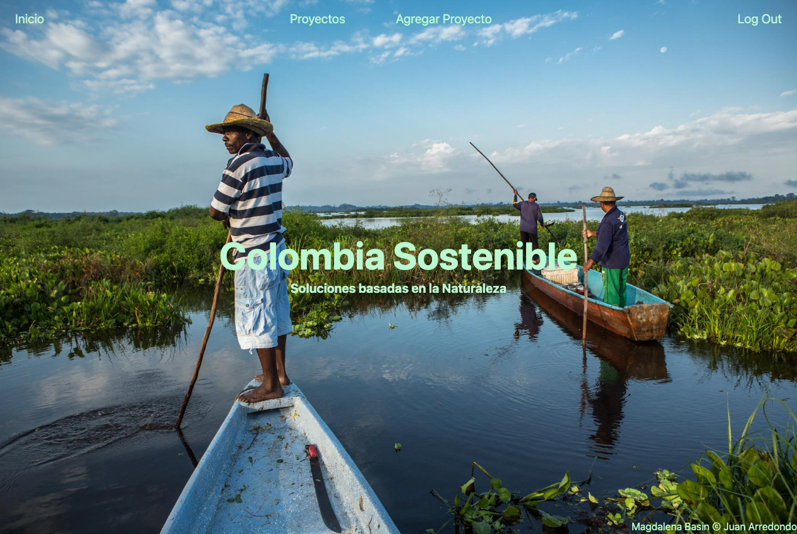
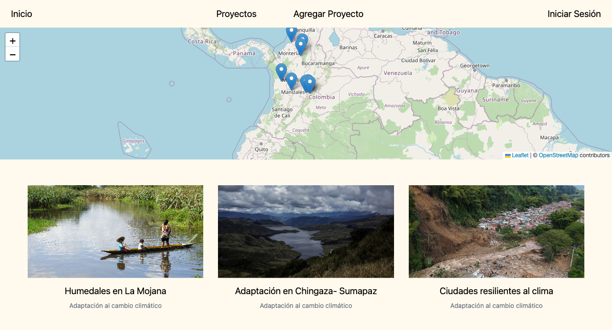
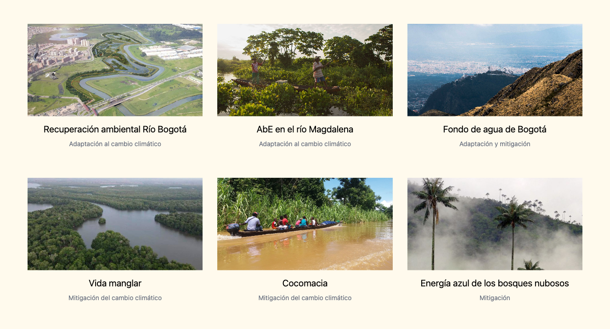
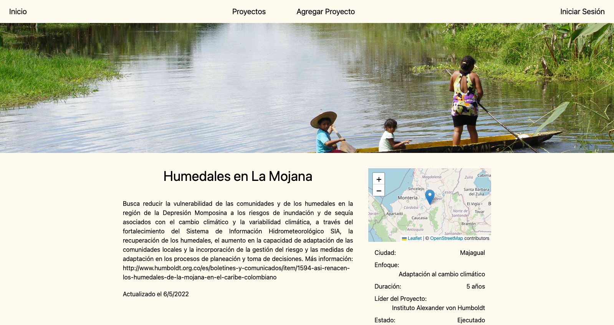
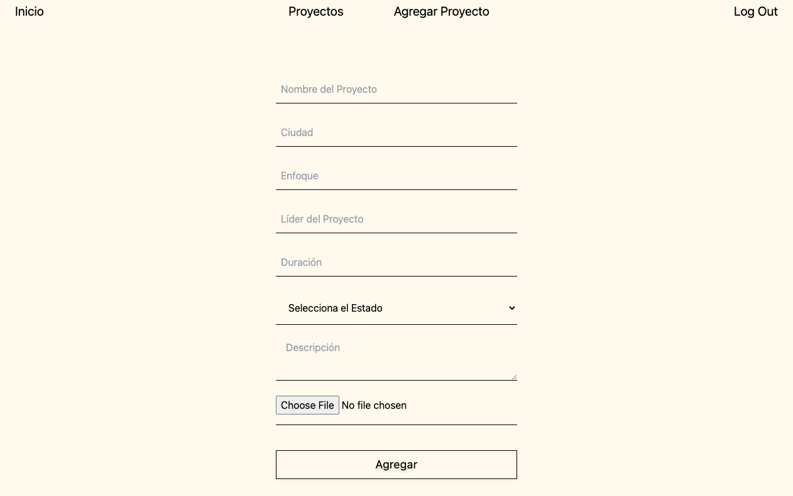

# Nature-Based-Solutions

## The App
The app showcases NbS for climate mitigation and adaptation in Colombia.

## Technologies
* Typescript
* Node
* Express
* MongoDB
* Mongoose
* GraphQL
* Passport
* Google OAuth

## Images
#### Main Page

#### Projects Page

#### Projects Detail Page

#### Add Project Form

